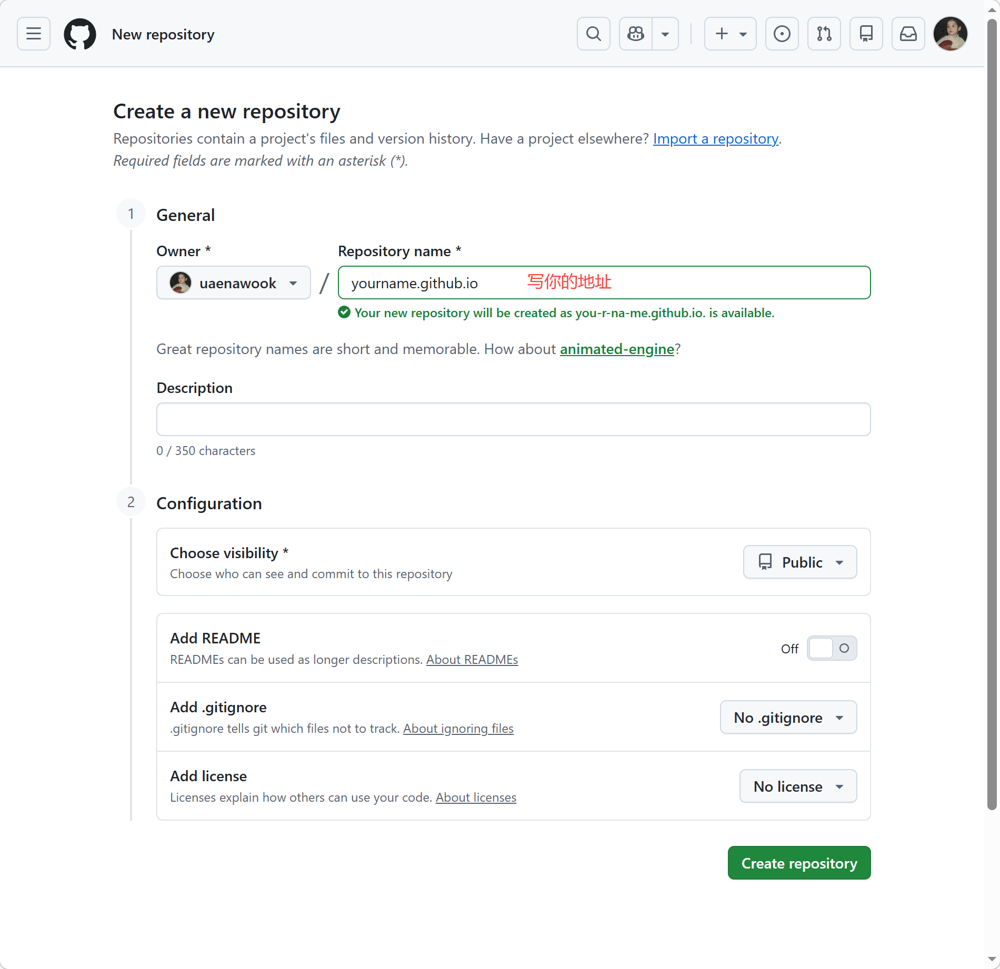
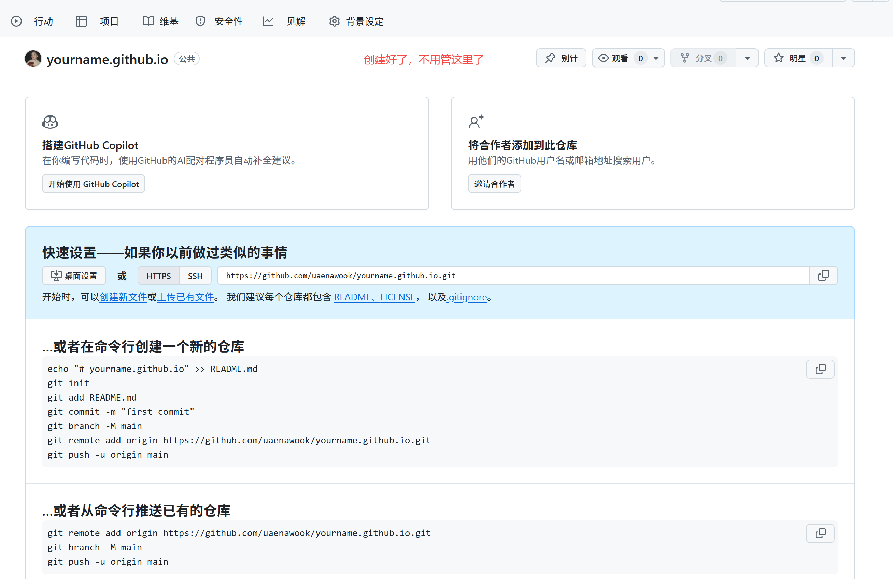
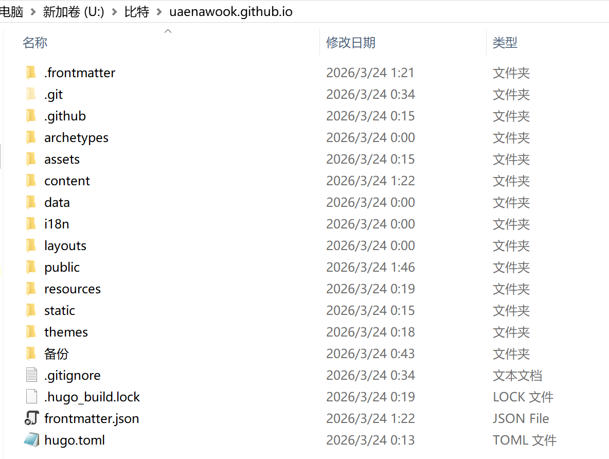
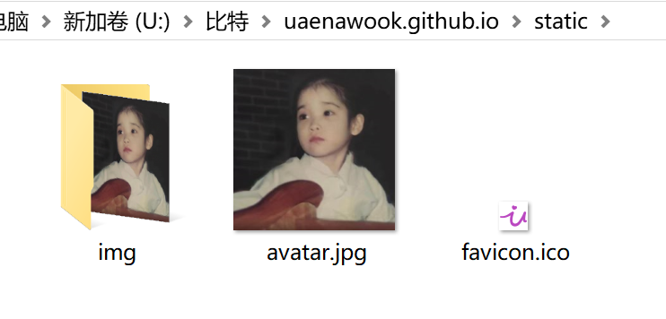
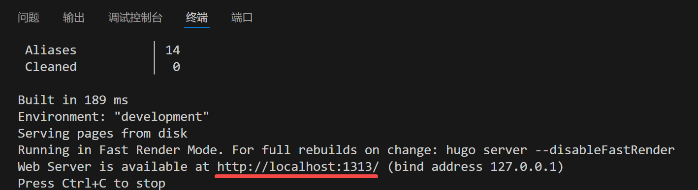
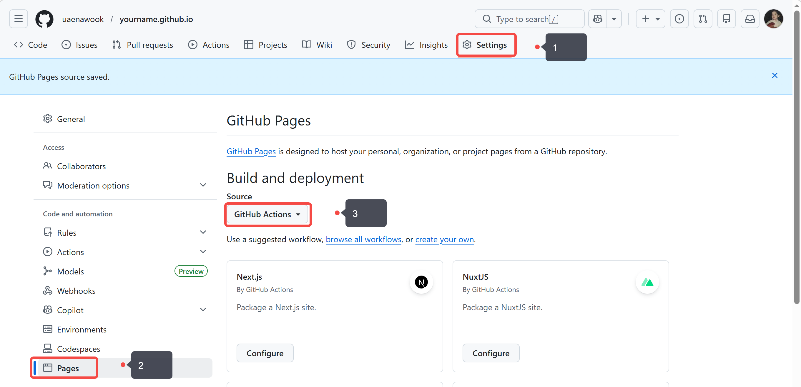
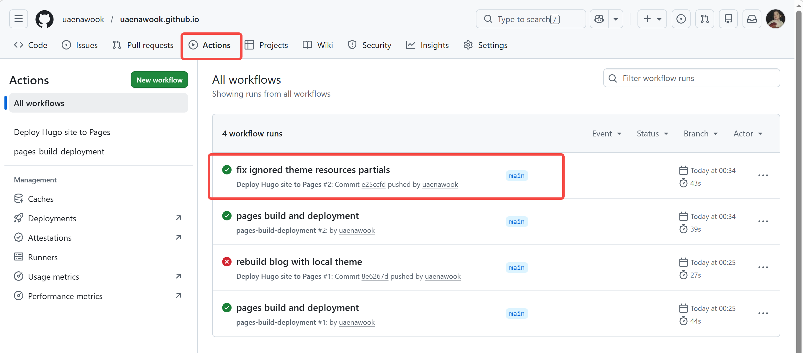
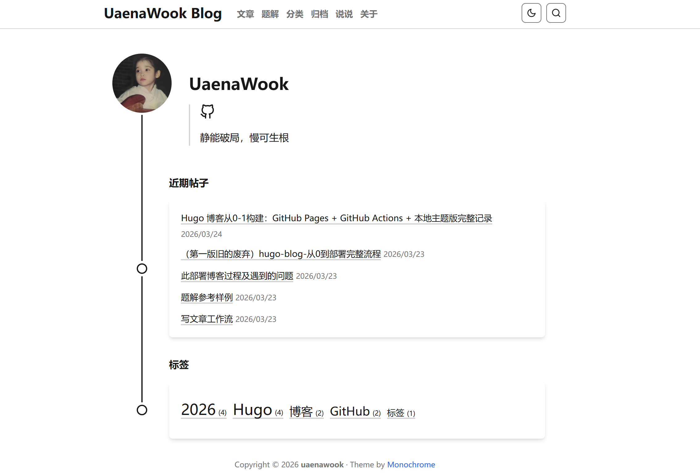
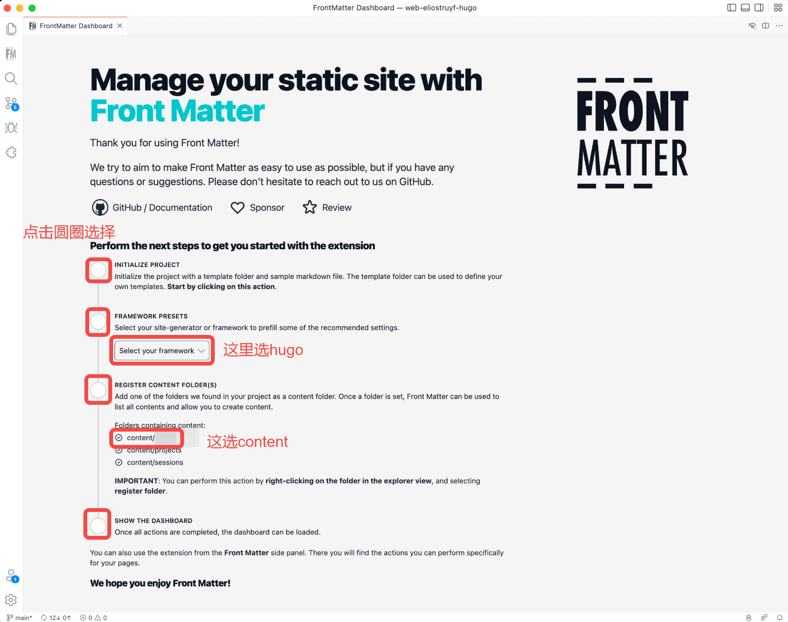

# Hugo 博客从0-1构建：GitHub Pages + GitHub Actions + 本地主题版完整记录

已知前提：

* 已安装 **Git**
* 已安装 **VS Code**
* 仓库名直接使用 **`uaenawook.github.io`**
* 主题直接使用 **Monochrome**

> 如果你不是 `uaenawook` 这个用户名，文中所有
> `uaenawook.github.io`、`https://uaenawook.github.io/`
> 都要改成你自己的 GitHub 用户名对应内容。

---

## 一、使用的工具和技术

| 工具 / 技术        | 作用                    |
| -------------- | --------------------- |
| Git            | 管理本地代码并推送到 GitHub     |
| VS Code        | 编辑项目文件、打开终端           |
| Hugo Extended  | 把 Markdown 和主题构建成静态网站 |
| GitHub         | 托管博客源码                |
| GitHub Pages   | 托管最终网站                |
| GitHub Actions | 自动构建并自动部署博客           |
| Monochrome     | Hugo 博客主题             |

---

## 二、在 GitHub 创建仓库

先登录 GitHub，点击右上角 `+`，选择 `New repository`。

按下面这样创建仓库：

* **Repository name**：`uaenawook.github.io`
* **Visibility**：`Public`

下面这些都**不要勾选**：

* `Add a README file`
* `Add .gitignore`
* `Choose a license`

也就是创建一个**空仓库**。

> 如果你不是 `uaenawook`，这里改成：
> **你的 GitHub 用户名 + `.github.io`**

>
> 1.创建仓库
> 
> 2. 仓库创建成功后的空仓库页面
> 

> 这里为什么用`用户名.github.io`作为仓库地址，因为这你访问的地址才是`uaenawook.github.io`否则访问地址为`uaenawook.github.io/uaenawook/`
---

## 三、安装 Hugo Extended

这一步直接用 **PowerShell** 安装，不手动去系统设置里改环境变量。

[Hugo][1]官方 Windows 文档给出的安装方式里，`winget` 是微软官方包管理器，安装 Extended 版的命令是：

```powershell
winget install Hugo.Hugo.Extended
```


### 1）打开 PowerShell

按 `Win` 键，搜索：

```text
PowerShell
```

然后打开。

### 2）执行安装命令

```powershell
winget install Hugo.Hugo.Extended
```

### 3）验证是否安装成功

安装完成后，关闭当前终端，再重新打开一个新的 PowerShell 或 VS Code 终端，执行：

```powershell
hugo version
```

如果能看到版本号，就说明安装成功了。官方文档明确推荐在 Windows 上用包管理器安装 Extended 版。

---

## 四、本地新建项目文件夹并打开终端

在你准备放博客的位置，新建一个文件夹：

```text
uaenawook.github.io
```

例如：

```text
U:\比特\uaenawook.github.io
```

打开终端的方法：

* 在文件夹空白处右键，选择 **Open Git Bash Here**

---

## 五、初始化 Git 仓库并绑定远程仓库

在项目根目录终端执行：

```bash
git init
git branch -M main
git remote add origin https://github.com/uaenawook/uaenawook.github.io.git
git remote -v
```

说明：

* `git init`：把当前文件夹初始化成 Git 仓库
* `git branch -M main`：把当前分支改成 `main`
* `git remote add origin ...`：绑定 GitHub 远程仓库
* `git remote -v`：检查远程仓库是否绑定成功

> 如果你不是 `uaenawook`，这里把
> `https://github.com/uaenawook/uaenawook.github.io.git`
> 改成你自己的仓库地址。

---

## 六、初始化 Hugo 项目

继续在根目录(`uaenawook.github.io`)执行：

```bash
hugo new site . --force
```

执行后会生成 Hugo 基础目录结构：

```text
uaenawook.github.io/
├─ archetypes/   # 文章模板
├─ assets/       # 资源文件
├─ content/      # 文章内容
├─ data/         # 数据文件
├─ layouts/      # 自定义模板
├─ static/       # 静态资源，例如图片
└─ hugo.toml     # Hugo 主配置文件
```

---

## 七、下载并放入主题

下载 [Monochrome 主题压缩包](https://themes.gohugo.io/themes/hugo-theme-monochrome/)，解压后把文件夹改名为：

```text
hugo-theme-monochrome # 一定要记住这个名字，配置里要用
```

然后放到项目里的 `themes` 目录下，最终结构如下：

```text
uaenawook.github.io/
├─ themes/
│  └─ hugo-theme-monochrome/   # Monochrome 主题目录
```

注意：

* 不要命名成 `hugo-theme-monochrome-main`
* **如果你下载的主题不是这个就不用改名字但是要记住。**
* 不要多套一层文件夹
* 目录名必须和配置文件中的主题名一致

> 主题目录放好后的截图
> 

---

## 八、配置 `hugo.toml`

在项目根目录找到 `hugo.toml`，最核心配置如下：

```toml
baseURL = "https://uaenawook.github.io/"
locale = "zh-CN"
title = "UaenaWook Blog"
theme = "hugo-theme-monochrome" # 改成你的主题文件夹名字
disableKinds = ["RSS"]
```

说明：

* `baseURL`：网站最终访问地址
* `locale`：语言地区
* `title`：网站标题
* `theme`：使用的主题目录名
* `disableKinds`：禁用 RSS 输出

> 如果你不是 `uaenawook`，把
> `https://uaenawook.github.io/`
> 改成你自己的网站地址。

> 把主题也要改成你的主题目录名

> 如果你想改网站标题，把
> `UaenaWook Blog`
> 改成你想要的名字。

我已经写好了完整配置，点击查看后复制到你的`hugo.toml`文件内并修改（此配置有些设置仅针对本主题，具体你可以发）

[阅读Git.txt](hugo.txt)

---

## 九、添加 GitHub Actions 自动部署文件

在项目根目录新建：

```text
.github/workflows/hugo.yml
```

这个文件的作用是：

* 每次推送到 `main` 分支时自动触发
* 自动安装 Hugo
* 自动构建博客
* 自动部署到 GitHub Pages

我已经写好了完整文件，点开阅读后直接覆盖你的`.github/workflows/hugo.yml`：
[hugo](github_workflows_hugo.txt) 

核心的头部示例(只做参考)：

```yaml
name: Deploy Hugo site to Pages

on:
  push:
    branches:
      - main
  workflow_dispatch:
```

---

## 十、添加 `.gitignore`

在项目根目录新建 `.gitignore`，内容如下：

```gitignore
public/
.hugo_build.lock
```

说明：

* `public/`：构建后的站点成品，不需要提交
* `.hugo_build.lock`：Hugo 运行时锁文件，不需要提交

---

## 十一、此时完整项目结构

```text
uaenawook.github.io/
├─ .github/
│  └─ workflows/
│     └─ hugo.yml                  # GitHub Actions 自动部署配置
├─ archetypes/                     
│  └─ default.md/                  # 文章模板
├─ assets/                         
│  └─ jsconfig.json/               # 资源文件
├─ content/                        # 文章内容
├─ data/                           # 数据文件
├─ layouts/                        # 自定义模板
├─ static/                         # 静态资源，例如图片
├─ themes/
│  └─ hugo-theme-monochrome/       # Monochrome 主题
├─ .gitignore                      # Git 忽略文件
└─ hugo.toml                       # Hugo 主配置
```
archetypes/[default.md](default.txt)

assets/[jsconfig.json](jsconfig.txt)

.github/workflows/[hugo.yml](github_workflows_hugo.txt)


根目录/[hugo.toml](hugo.txt) 

static目录
> 

---

## 十二、本地运行测试

在项目根目录执行：

```bash
hugo
```

如果没有报错，说明项目可以正常构建。

然后执行：

```bash
hugo server -D
```

如果成功，会看到类似提示：

```text
Web Server is available at http://localhost:1313/
```

然后在浏览器打开：

```text
http://localhost:1313/
```

检查：

* 首页是否正常
* 文章是否正常
* 样式是否正常
* 图片是否正常
* 菜单是否正常

> 本地 `hugo server -D` 跑成功的终端截图
> 

---

## 十三、首次提交并推送到 GitHub

确认本地没问题后，执行：

```bash
git status
git add .
git commit -m "rebuild blog with local theme"
git push -u origin main
```

说明：

* `git status`：查看当前状态
* `git add .`：把当前文件加入暂存区
* `git commit -m ...`：生成一次提交
* `git push -u origin main`：推送到 GitHub

---

## 十四、设置 GitHub Pages 发布源

推送成功后，打开 GitHub 仓库，进入：

```text
Settings -> Pages
```

把 `Build and deployment` 里的 `Source` 设置为：

```text
GitHub Actions
```

这样以后每次 `git push`，都会自动构建并自动部署。

> 

---

## 十五、查看 Actions 是否成功

打开仓库的：

```text
Actions
```

如果工作流正常，你会看到自动部署流程运行并通过。

> GitHub Actions 成功通过的截图
> 

---

## 十六、访问网站

部署成功后，直接访问：

```text
https://uaenawook.github.io/
```

> 如果你不是 `uaenawook`，这里改成你自己的 GitHub Pages 地址。

到这里，博客就已经正式上线了。
> 

---

## 十七、后续如何管理博客

后面管理博客，主要有两种方式。

### 1）用 VS Code 管理

适合改配置、写文章、改主题、看项目结构。

你后面最常改的目录和文件：

```text
content/      # 写文章
static/       # 放图片
hugo.toml     # 改网站配置
themes/       # 改主题
```

### 2）用 Front Matter CMS 管理

如果你不想总是手动改 Markdown 文件，可以用 **Front Matter CMS**。

它是 VS Code 里的内容管理扩展，适合：

* 新建文章
* 管理文章标题、日期、标签、封面
* 更方便地编辑 Markdown
* 以更接近 CMS 的方式管理博客内容

简单理解：

* **VS Code**：管理整个博客项目
* **Front Matter CMS**：更方便地管理博客文章内容
[FM教程](https://frontmatter.codes/docs/getting-started#required-configuration)

> 1.先点初始化

> 2.第二项选hugo
> 
> 3.文件夹选`content`


---

## 十八、以后更新博客的标准流程

以后每次更新博客，基本就是：
更新文章参见[写文章工作流]()
```bash
hugo new index.md # 把生成的文件拷贝到所需目录
git add .
git commit -m "update blog"
git push
```

然后 GitHub Actions 会自动重新部署。

[1]: https://gohugo.io/installation/windows/?utm_source=chatgpt.com "Windows"
