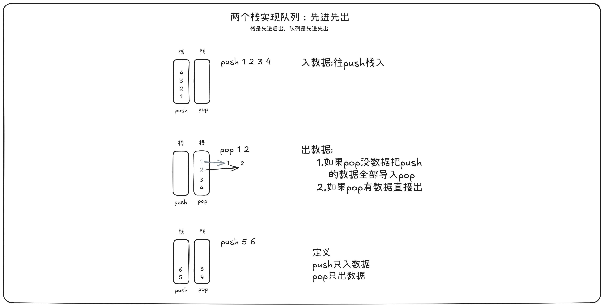

LeetCode：[232. 用栈实现队列](https://leetcode.cn/problems/implement-queue-using-stacks/description/)

想要更直观地理解？请点击这里：[🚀 打开【栈模拟队列】全屏交互演示](/tools/stack-queue.html)

图解：



代码：

```C

typedef int STDataType;
typedef struct Stack
{
	STDataType* arr;
	int top;
	int capacity;
}ST;


// 初始化和销毁
void STInit(ST* pst);
void STDestroy(ST* pst);

// 入栈  出栈
void STPush(ST* pst, STDataType x);
void STPop(ST* pst);

// 取栈顶数据
STDataType STTop(ST* pst);

// 判空
bool STEmpty(ST* pst);
// 获取数据个数
int STSize(ST* pst);

// 初始化和销毁
void STInit(ST* pst)
{
	assert(pst);
	pst->arr = NULL;
	pst->top = 0;
	pst->capacity = 0;
}
void STDestroy(ST* pst)
{
	assert(pst);
	free(pst->arr);
	pst->arr = NULL;
	pst->top = 0;
	pst->capacity = 0;
}

// 入栈  出栈
void STPush(ST* pst, STDataType x)
{
	assert(pst);
	if (pst->top == pst->capacity)
	{
		int newCapacity = pst->capacity == 0 ? 4 : pst->capacity * 2;
		STDataType* newNode = (STDataType*)realloc(pst->arr, sizeof(STDataType) * newCapacity);
		if (newNode == NULL)
		{
			printf("STPush realloc fail!");
			exit(-1);
		}

		pst->arr = newNode;
		pst->capacity = newCapacity;
	}
	pst->arr[pst->top] = x;
	pst->top++;

}
void STPop(ST* pst)
{
	assert(pst && pst->top > 0);
	pst->top--;
}

// 取栈顶数据
STDataType STTop(ST* pst)
{
	assert(pst && pst->top > 0);
	return pst->arr[pst->top-1];
}

// 判空
bool STEmpty(ST* pst)
{
	assert(pst);
	return pst->top == 0;
}
// 获取数据个数
int STSize(ST* pst)
{
	assert(pst);
	return pst->top;
}

typedef struct {
    ST pushStack;
    ST popStack;
} MyQueue;


MyQueue* myQueueCreate() {
    MyQueue* newNode = (MyQueue*)malloc(sizeof(MyQueue));
    STInit(&(newNode->pushStack));
    STInit(&(newNode->popStack));

    return newNode;
}

void myQueuePush(MyQueue* obj, int x) {
    STPush(&(obj->pushStack),x);
}

int myQueuePop(MyQueue* obj) {
    if(STEmpty(&(obj->popStack)))
    {
        while(!STEmpty(&(obj->pushStack)))
        {
            int x = STTop(&(obj->pushStack));
            STPush(&(obj->popStack),x);
            STPop(&(obj->pushStack));
        }
    }
    int ret = STTop(&(obj->popStack));
    STPop(&(obj->popStack));
    return ret;
}

int myQueuePeek(MyQueue* obj) {
    if(STEmpty(&(obj->popStack)))
    {
        while(!STEmpty(&(obj->pushStack)))
        {
            int x = STTop(&(obj->pushStack));
            STPush(&(obj->popStack),x);
            STPop(&(obj->pushStack));
        }
    }
    int ret = STTop(&(obj->popStack));
    return ret;
}

bool myQueueEmpty(MyQueue* obj) {
    return STEmpty(&(obj->popStack)) && STEmpty(&(obj->pushStack));
}

void myQueueFree(MyQueue* obj) {
    STDestroy(&(obj->popStack));
    STDestroy(&(obj->pushStack));
    free(obj);
}

/**
 * Your MyQueue struct will be instantiated and called as such:
 * MyQueue* obj = myQueueCreate();
 * myQueuePush(obj, x);
 
 * int param_2 = myQueuePop(obj);
 
 * int param_3 = myQueuePeek(obj);
 
 * bool param_4 = myQueueEmpty(obj);
 
 * myQueueFree(obj);
*/
```