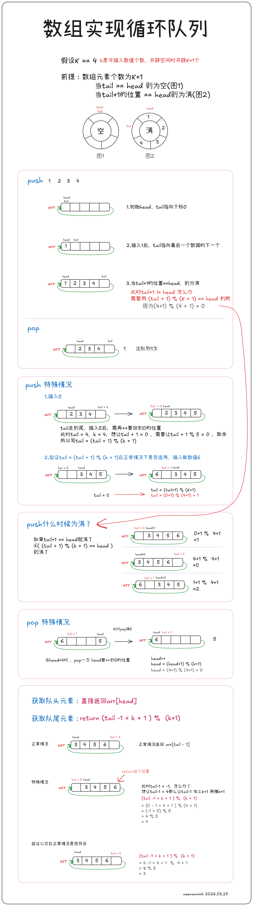

### 题目：
LeetCode：[622. 设计循环队列](https://leetcode.cn/problems/design-circular-queue/description/)


### 图解：



### 代码

```c


typedef int QDataType;
typedef struct {
    QDataType* arr;
    int head;
    int tail;
    int k;
} MyCircularQueue;


MyCircularQueue* myCircularQueueCreate(int k) {
    MyCircularQueue* NewNode = (MyCircularQueue*)malloc(sizeof(MyCircularQueue));
    NewNode->arr = (QDataType*)malloc(sizeof(QDataType)*(k+1));
    NewNode->head = NewNode->tail = 0;
    NewNode->k  = k;
    return NewNode;
}

bool myCircularQueueEnQueue(MyCircularQueue* obj, int value) {
    assert(obj);
    //判断是否插入满
    if((obj->tail + 1) % (obj->k + 1) == obj->head)
    {
        return false;
    }
    else
    {
        //空间没满，则插入数据
        obj->arr[obj->tail] = value;
        obj->tail = (obj->tail+1) % (obj->k + 1);
        return true;
    }
}

bool myCircularQueueDeQueue(MyCircularQueue* obj) {
    assert(obj);
    //检查是否有元素
    if(obj->head == obj->tail)
    {
        return false;
    }
    else
    {
        obj->head = (obj->head+1) % (obj->k + 1 );
        return true;
    }
}

int myCircularQueueFront(MyCircularQueue* obj) {
    assert(obj);
    if(obj->head == obj->tail)
    {
        return -1;
    }
    else
    {
        return obj->arr[obj->head];
    }
}

int myCircularQueueRear(MyCircularQueue* obj) {
    assert(obj);
    if(obj->head == obj->tail)
    {
        return -1;
    }
    else
    {
        //返回队尾元素
        return obj->arr[(obj->tail -1 + obj->k + 1) % (obj->k + 1)];
    }
}

bool myCircularQueueIsEmpty(MyCircularQueue* obj) {
    assert(obj);
    return obj->head == obj->tail;
}

bool myCircularQueueIsFull(MyCircularQueue* obj) {
    assert(obj);
    return (obj->tail + 1) % (obj->k + 1) == obj->head;
}

void myCircularQueueFree(MyCircularQueue* obj) {
    free(obj->arr);
    obj->arr = NULL;
    obj->head = obj->tail = 0;
    free(obj);
    obj = NULL;
}

/**
 * Your MyCircularQueue struct will be instantiated and called as such:
 * MyCircularQueue* obj = myCircularQueueCreate(k);
 * bool param_1 = myCircularQueueEnQueue(obj, value);
 
 * bool param_2 = myCircularQueueDeQueue(obj);
 
 * int param_3 = myCircularQueueFront(obj);
 
 * int param_4 = myCircularQueueRear(obj);
 
 * bool param_5 = myCircularQueueIsEmpty(obj);
 
 * bool param_6 = myCircularQueueIsFull(obj);
 
 * myCircularQueueFree(obj);
*/
```
