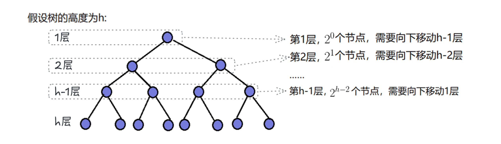
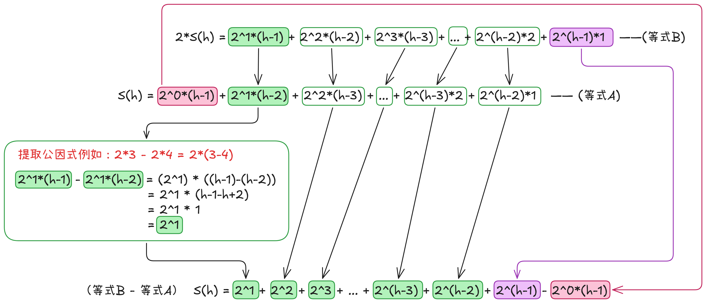
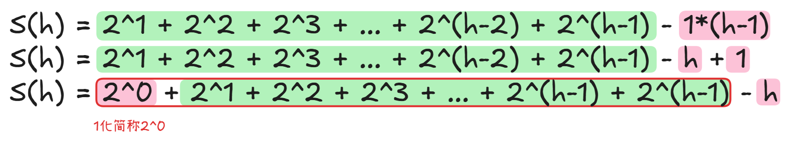
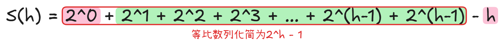

# 基于自底向上 (Sift-Down) 策略的建堆时间复杂度推导

**目标：** 运用代数推导与错位相减法，证明将 $n$ 个无序节点构建为二叉堆的最坏情况时间复杂度为 $O(n)$。

## 一、【第一阶段目标：确定单层节点数、单层最大下沉步数】

此处我们用满二叉树推导：

- 设 $n$：代表这颗满二叉树的总节点个数
- 设 $h$：代表这棵树的总高度（最大层数）
- 设 $i$：代表我们当前正在观察的第 $i$ 层（取值范围是 1 到 $h$）

### 1. 物理量 1：第 $i$ 层的节点总数

*(说明：数学来源解析)*

- **逻辑推导：** 在满二叉树中，每层节点数是上一层的 2 倍（等比关系）
- **通用结论：** 位于第 $i$ 层的节点总数为 $2^{i-1}$ 个。
- **规律列举：**
  - 第 1 层节点数：$2^0 = 1$ 个
  - 第 2 层节点数：$2^1 = 2$ 个
  - ......
  - 第 $h-1$ 层节点数：$2^{h-2}$ 个（这是建堆真正的起始层）
  - ~~第 $h$ 层节点数：$2^{h-1}$ 个（叶子节点（第 $h$ 层）无子节点，天然满足堆性质。）~~

### 2. 物理量 2：第 $i$ 层节点的最坏下沉步数

- **推导逻辑：** 节点最坏情况需要一直向下交换，直到叶子节点（第 $h$ 层）为止
- **通用结论：** 位于第 $i$ 层的节点，最多向下调整 $h-i$ 次
- **规律列举：**
  - 第 1 层节点：下方有 $h-1$ 层，最多向下移动 $h-1$ 次
  - 第 2 层节点：下方有 $h-2$ 层，最多向下移动 $h-2$ 次
  - ......
  - 第 $h-2$ 层节点：下方有 2 层，最多向下移动 2 次
  - 第 $h-1$ 层节点：下方有 1 层，最多向下移动 1 次
  - ~~第 $h$ 层节点：下方有 0 层，最多向下移动 0 次~~

------

## 二、【第二阶段目标：构建总步数函数 $S(h)$，将每层节点数、最坏下沉步数进行乘积求和】

### 1. 明确定义

我们推导的是基于树高 $h$ 的总步数，必须严格记为 $S(h)$。

### 2. 组装求和项

因为：

- 总步数 = $\sum$ (单层节点数 $\times$ 单层节点最坏调整步数)
- 第 1 层总移动步数：$2^0 \times (h - 1)$
- 第 2 层总移动步数：$2^1 \times (h - 2)$
- ......
- 第 $h-2$ 层总移动步数：$2^{h-3} \times 2$
- 第 $h-1$ 层总移动步数：$2^{h-2} \times 1$

### 3. 得出代数模型（等式 A）

所以：

$$S(h) = 2^0(h-1) + 2^1(h-2) + 2^2(h-3) + \dots + 2^{h-3} \cdot 2 + 2^{h-2} \cdot 1 \quad \text{—— (等式 A)}$$

### 4. 解释数学模型特征

观察等式 A 的每一项：

左侧因式 ($2^0, 2^1, 2^2, \dots$) 构成等比数列；右侧因式 ($h-1, h-2, h-3, \dots$) 构成等差数列。

**结论：** $S(h)$ 是一个典型的差比数列求和模型。

## 三、【第三阶段目标：运用错位相减法求解 $S(h)$】

### 1. 等式 A
$$S(h) = 2^0(h-1) + 2^1(h-2) + 2^2(h-3) + \dots + 2^{h-3} \cdot 2 + 2^{h-2} \cdot 1 \quad \text{—— (等式 A)}$$
### 2. 构建等式 B
为了消除中间的复杂项，把等式两边同乘等比数列的公比（公比 $q=2$），计算出等式 B：
$$2S(h) = 2^1(h-1) + 2^2(h-2) + 2^3(h-3) + \dots + 2^{h-2} \cdot 2 + 2^{h-1} \cdot 1 \quad \text{—— (等式 B)}$$

### 3. 两个式子错位相减
为了化简等式，将 (等式 B - 等式 A)，把对齐的中间项相减去除。
即：
$$S(h) = 2^1 + 2^2 + 2^3 + \dots + 2^{h-2} + 2^{h-1} - (h-1)$$

### 4. 化简
将等式尾部的 $-(h-1)$ 拆解为 $-h + 1$：
$$S(h) = 2^1 + 2^2 + 2^3 + \dots + 2^{h-1} - h + 1$$

为了凑齐完整的等比数列，将常数 $1$ 转化为 $2^0$，并将其移至数列首部：
$$S(h) = [2^0 + 2^1 + 2^2 + 2^3 + \dots + 2^{h-1}] - h$$

此时，上面等式中括号内的部分构成了标准的等比数列。
根据等比数列求和公式计算：
* 首项 $a_1 = 1$
* 公比 $q = 2$
* 项数 $k = h$ （从 $2^0$ 到 $2^{h-1}$，共有 $h$ 项）

代入公式 $S_k = \frac{a_1(q^k - 1)}{q - 1}$ 计算得出：
$$S_{等比} = \frac{1 \cdot (2^h - 1)}{2 - 1} = 2^h - 1$$

将该结果代回原式，得出最终的闭式解：[等比数列求和公式](#补充推导-3等比数列求和公式推导错位相减法)

$$S(h) = 2^h - 1 - h$$

## 四、【第四阶段目标：变量代换与渐进复杂度分析】

**目标：** 消去中间变量 $h$，将基于高度的函数 $S(h)$ 转换为基于数据规模的函数 $T(n)$。

### 1. 建立高度 $h$ 与节点数 $n$ 的映射关系

（前置知识验证：基于满二叉树等比求和性质及对数定义，映射关系成立）

* 满二叉树总节点数与高度的关系：$n = 2^h - 1$
    - [满二叉树的总节点数计算](#补充推导-1满二叉树的总节点数计算)
* 反解树高 $h$：由 $2^h = n + 1$，运用对数转换得出 $h = \log_2(n+1)$
    - [通过对数公式求树高](#补充推导-2通过对数公式求树高)

### 2. 终极代换求解 $T(n)$

将上述映射关系直接代入第三阶段求出的 $S(h) = 2^h - 1 - h$ 中：
$$T(n) = (n + 1) - 1 - \log_2(n+1)$$
$$T(n) = n - \log_2(n+1)$$

### 3. 大 O 渐进分析 (Asymptotic Analysis)

在大 O 表示法中，当数据规模 $n$ 极大时，需忽略低阶项：

* **量级对比：** 线性项 $n$ 的增长速率远大于对数项。例如当 $n = 1,000,000,000$（十亿）时，$\log_2 n$ 仅约为 30。
* **结论提取：** 相比于 $n$，对数项 $\log_2(n+1)$ 微不足道，直接作为低阶项舍去。

**最终结论：** 整体调整步数收敛于线性级别，自底向上（Sift-Down）建堆的最坏情况时间复杂度严格证明为 **$O(n)$**。

---

## 补充

### 补充推导 1：满二叉树的总节点数计算
[返回](#四第四阶段目标变量代换与渐进复杂度分析)

假设满二叉树高度为 $h$，总节点数为 $n$。

各层节点数依次为：
* 第一层：$2^0$
* 第二层：$2^1$
* 第三层：$2^2$
* ......
* 第 $h$ 层：$2^{h-1}$

总节点数 $n$ 即为上述各项之和。根据等比数列求和公式 $S_k = \frac{a_1(q^k - 1)}{q - 1}$：
* 首项 $a_1 = 1$
* 公比 $q = 2$
* **项数 $k = h$** （共有 $h$ 层）

代入公式，得出高度为 $h$ 的满二叉树总节点数为：
$$n = S_h = \frac{1 \cdot (2^h - 1)}{2 - 1} = 2^h - 1$$

### 补充推导 2：通过对数公式求树高 $h$
[返回](#四第四阶段目标变量代换与渐进复杂度分析)

已知满二叉树总节点数 $n$ 与高度 $h$ 的关系为：$n + 1 = 2^h$

**对数公式复习：**
* 表达式：$\log_a b = x \iff a^x = b$
* 含义：$a$ 的几次幂等于 $b$？
* 术语：$a$ 为底数，**$b$ 为真数**。

**代入转换：**
既然 $a^x = b$ 可以转换为 $x = \log_a b$
那么 $2^h = n + 1$ 即可转换为：
$$h = \log_2(n+1)$$

### 补充推导 3：等比数列求和公式推导（错位相减法）
[返回](#4-化简)

**1. 明确定义与变量：**

- $a_1$（或简写为 $a$）：代表首项（数列里的第一个数字）。
- $q$：代表公比（后一个数字是前一个数字的多少倍）。
- $n$：代表项数（这串数字里一共有多少个数）。
- $S_n$：代表前 $n$ 项的和（Sum）。

**例子对应：**

对于数列 1, 2, 4, 8, 16：

- $a_1 = 1$
- $q = 2$
- $n = 5$（一共有 5 个数）
- 我们要求的目标就是 $S_5 = 1 + 2 + 4 + 8 + 16$。

**2. 数列的通用表达形式**

利用乘方概念，这串求和式子可以写成字母形式：

$$S_n = a_1 + a_1q + a_1q^2 + a_1q^3 + \dots + a_1q^{n-1}$$

*(注意：最后一项是 $q^{n-1}$，是因为第一项是从 $q^0$ 开始算的。)*

**3. 核心魔术：错位相减法**

这是最关键的一步。我们要利用等式的性质和分配律，把中间那些复杂的加法全部消掉。

- **第一步：列出原式**

  $$S_n = a_1 + a_1q + a_1q^2 + \dots + a_1q^{n-1} \quad \text{—— (式子 A)}$$

- **第二步：整体放大 $q$ 倍**

  根据等式性质，两边同时乘 $q$：

  $$q \cdot S_n = a_1q + a_1q^2 + a_1q^3 + \dots + a_1q^n \quad \text{—— (式子 B)}$$

- **第三步：相减（见证奇迹）**

  用 (式子 B) 减去 (式子 A)。你会发现，中间长得一模一样的项都被“减没”了：

  $$(q - 1) \cdot S_n = a_1q^n - a_1$$

- **第四步：提取公因式并变形**

  根据分配律的反向提取：

  $$(q - 1) \cdot S_n = a_1(q^n - 1)$$

  最后，为了求出 $S_n$，在**前提条件 $q \neq 1$** 的情况下，我们把 $(q - 1)$ 移到等号右边（变成除法）：

  $$S_n = \frac{a_1(q^n - 1)}{q - 1}$$

**4. 最终公式与代入验证**

这就是我们要找的等比数列求和公式。我们拿你笔记里的例子验证一下：$1 + 2 + 4 + 8$（此时 $a_1 = 1, q = 2, n = 4$）。

- **方法一（硬算）：**

  $$1 + 2 + 4 + 8 = 15$$

- **方法二（套公式）：**

  $$S_4 = \frac{1 \cdot (2^4 - 1)}{2 - 1} = \frac{16 - 1}{1} = 15$$

**结论：** 结果完全一致，推导逻辑闭环成立！